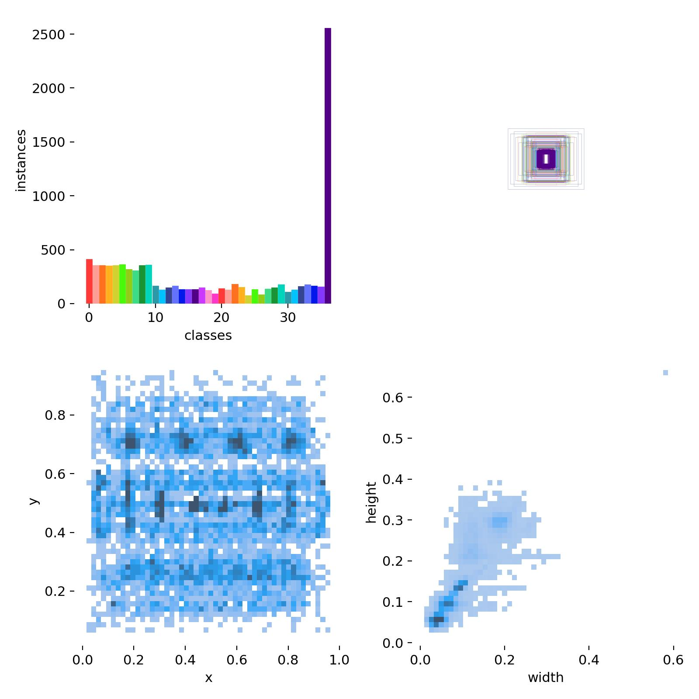
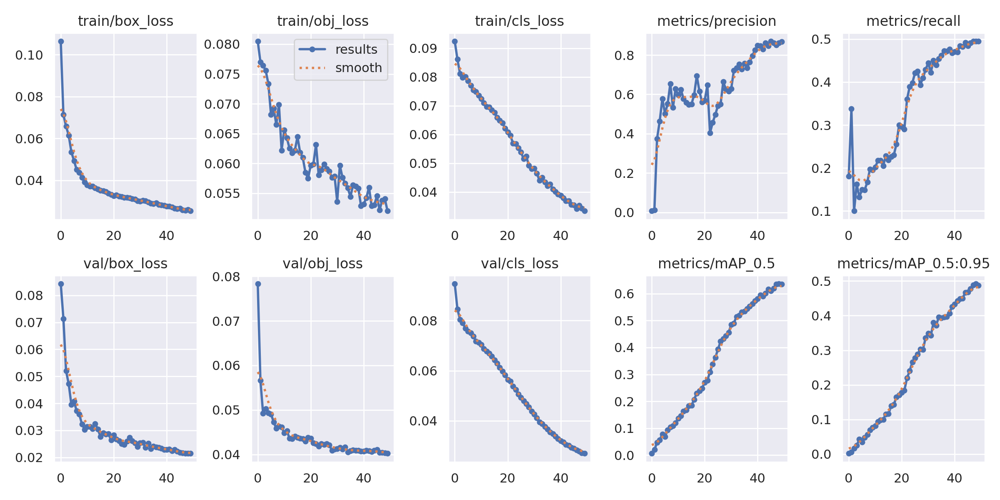
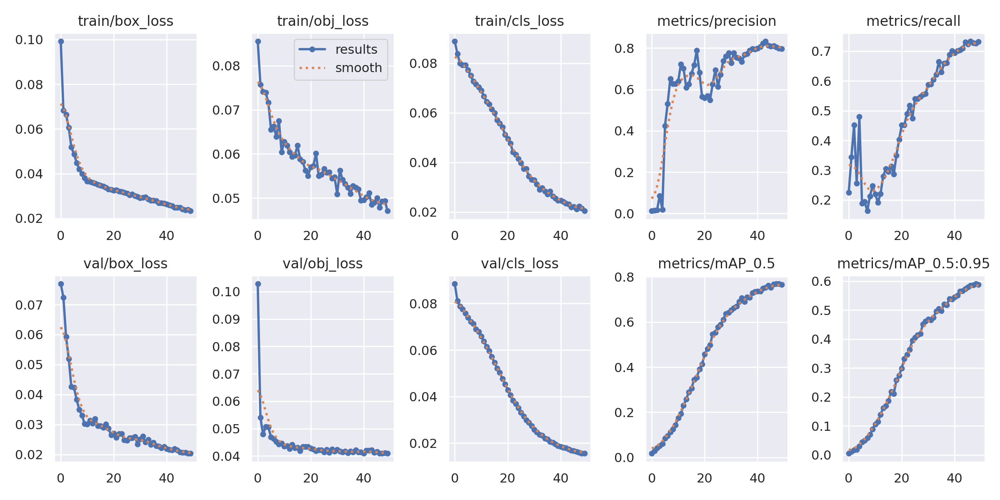
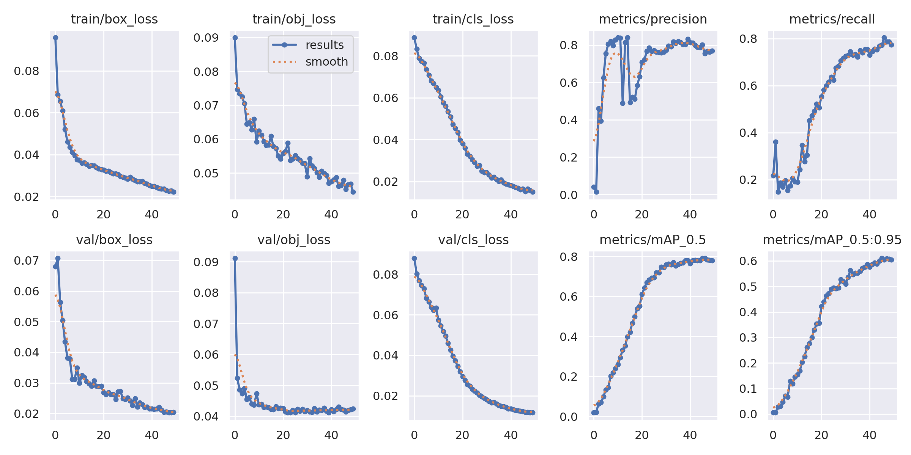
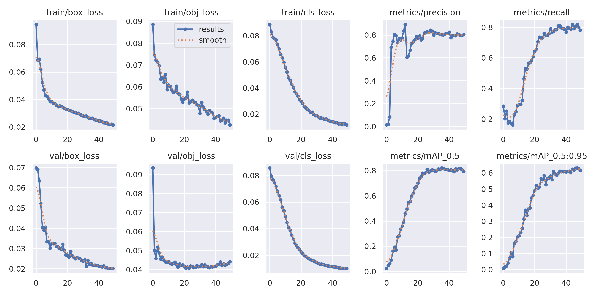
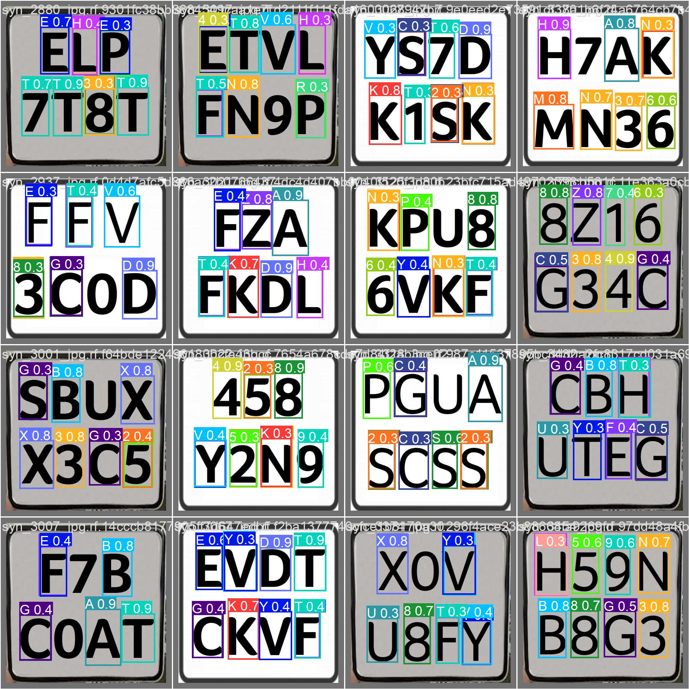
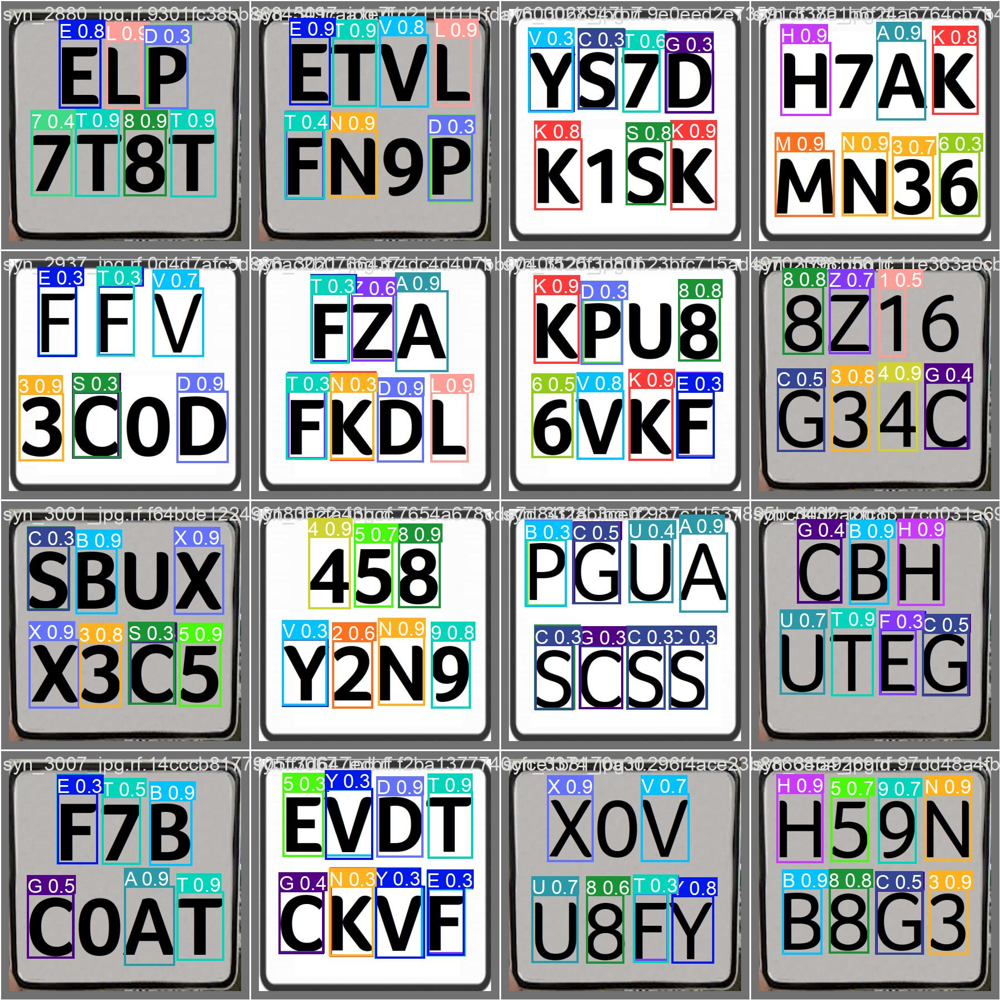
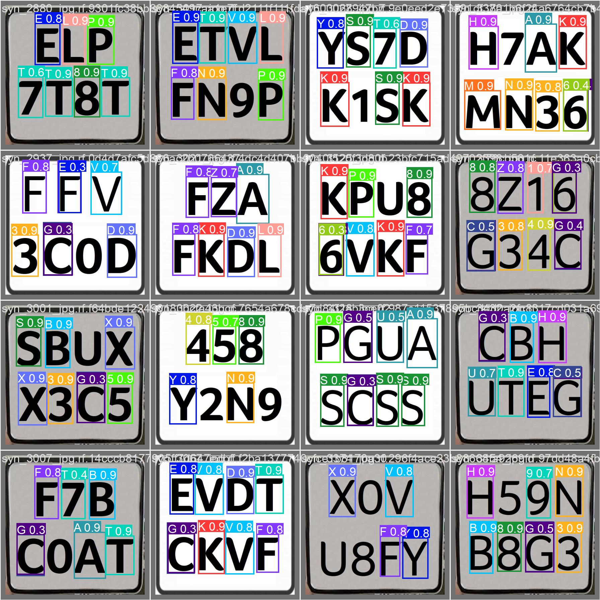
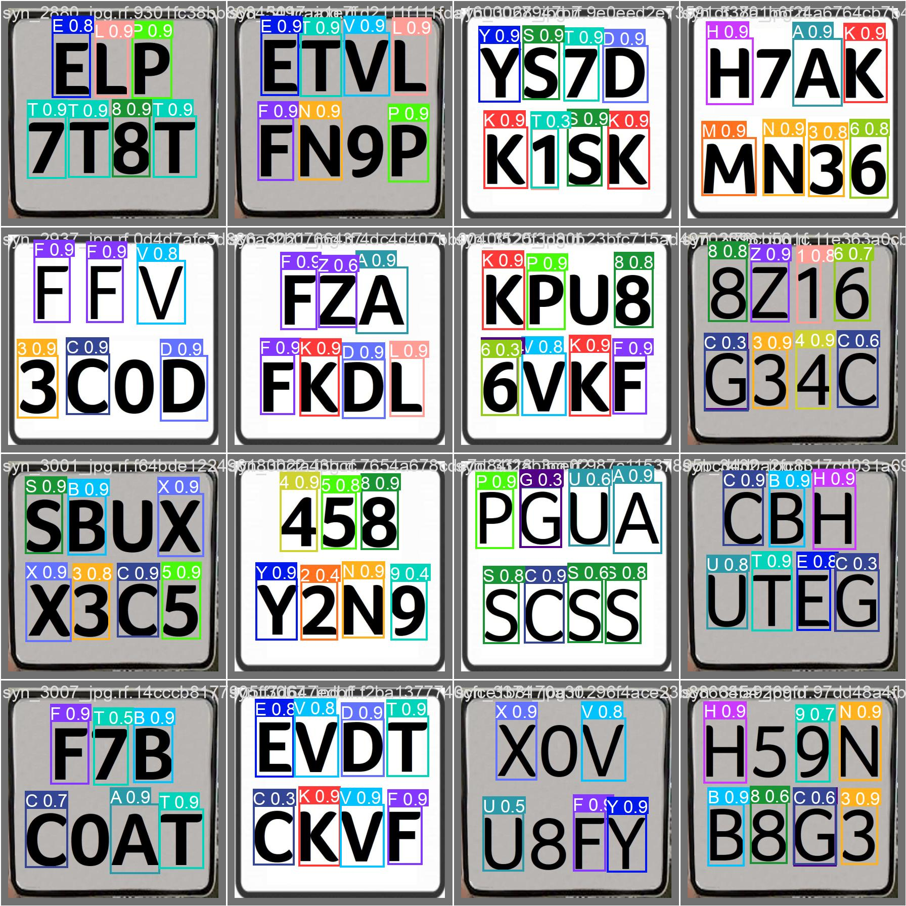

# AI Image Translator Project

## Project Results and Overview

This project aims to develop an AI-powered translator for translating text within images and videos. The initial focus was on developing a robust model capable of detecting and interpreting printed text using state-of-the-art AI techniques.
I used YOLOv5 models to perform object detection and image analysis, which allowed the AI to accurately identify and translate text within images.
To get more data, I trained the 4 models S,M,L and X from YOLOv5.

### Key Objectives:
- Develop a dataset for training an AI model.
- Employ machine learning techniques for image text detection and translation.
- Evaluate the performance and accuracy of the model.

## Source Code

The source code for this project is organized into the following structure:

- `src/`: Contains all the source code files.
- `Results/`: Used for storing datasets, both raw and processed.
- `dataset/`: Pre-trained models and training scripts.

### Setup

1. Clone this repository to your local machine.
2. Ensure Python 3.x is installed.
3. Install the required packages via `pip install -r requirements.txt`.

## Performance Metrics

The project's results are evaluated based on several key metrics:
- **Accuracy**: The correctness of the detected translations.
- **Speed**: Time taken to process and translate text from images.
- **Memory Efficiency**: Resource usage of the model.

Graphs and tables will be utilized to present these metrics for easier comprehension.

Here is the label repartition of my dataset : 

    

For every compared result, the images will be sorted in that way:

|   S   | M     |
|-------|-------|
| **L** | **X** |

This is all the data around my results for every model :

    
    

    
    

## Installation and Usage

### Installation Steps:

1. Go on google Colab : https://colab.research.google.com/drive/1IuSO9jdh782gYt2TYIDt9xVpBTRKXiJm?usp=sharing

2. You can train the AI to get your own folders

### Usage:
- To train the model, you have all codes to train YOLOv5 models on my GOOGLE colab.

## References and Documentation

- [YOLOv5 Model Overview](https://github.com/ultralytics/yolov5)
- https://colab.research.google.com/drive/1IuSO9jdh782gYt2TYIDt9xVpBTRKXiJm?usp=sharing

## Issues and Contributions

We welcome contributions to this project. You can contribute by:

- Reporting bugs and issues.
- Suggesting enhancements and new features.
- Submitting pull requests.

## Future Work

Potential areas for future work include:
- Enhancing text recognition accuracy.
- Expanding to support handwritten text translation.
- Implementing support for additional languages.